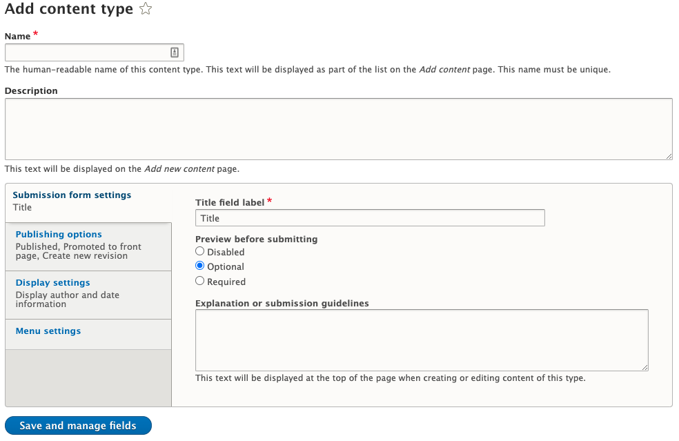
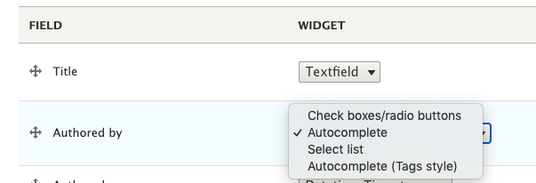
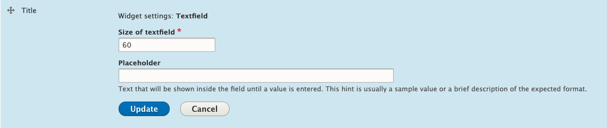

# Content Types

Creating a content type is an essential integration task. By creating content types, you define the types of nodes in the CMS, what fields they have, how those fields display in the edit form, and how certain fields render in the theme.

While most content types will be rendered as pages visited by an end user, you can also create content types that only exist as dynamic content. For example, the client could have courses but want specific offerings of a course to appear in the aggregate, ordered by term and section. This data may be too complex to represent on a single content type, so a "Course Offering" content type could be created to represent a single offering of a course. This content type would appear as results in the aggregate, but would direct the end user to the main course detail when clicked.

If there is a need to represent dynamic complex data in Drupal, using a content type for it is very appropriate. 

## Creating a Content Type

Navigate to `/admin/structure/types`.

By default, Drupal does not come with any Content Types.

Click `Add content type` to create one.



Give the content type a Name. You will notice that Drupal will automatically give a machine name after typing.

### Naming

It's a good idea to give a content type a human readable name to give context to what the content type is for. For example, "Page - Home Page", "Page - Level Page" for nodes that will be visited as pages. However, when providing these human readable names to a content type, it's recommended that you edit the machine name to be a simple slug, rather than what Drupal makes it automatically.

For example, using "Page - Home Page" will get an automatic machine name "page_home_page". We would recommend this be changed to "home". Machine names are used by the templating system to look for specific file names, so rather than looking for `node--page-home-page.html.twig`, it would look for `node--home.html.twig`.

Try to keep machine names for content types to single words. Use underscores if a separation is necessary.

### Settings

For the description field, there is no need to enter anything at initial creation, but this should eventually be updated to include helpful notes on the content type. This field accepts basic HTML.

Below the description, there is a vertical tab interface. There may be more than four tabs depending on the modules you have installed. For this guide, we will assume the four basic tabs.

#### Submission form settings

The title field label is, as described, the label that appears for the Drupal Title field for the node you create. Generally, there is little reason to change this to something other than Title, but if you needed something like "Name" for a content type representing a person or organization, this is where you would change that. It does not change the field machine name of title.

Preview before submitting is for when you want to require the content author to preview a rendered, unpublished version of their page before saving.

The explanation or submission guidelines are useful if there is a workflow in place on the site. It is not required.

#### Publishing options

The "Published" checkbox is for if the node will be published on initial save or not. The box will be checked or unchecked to publish depending on this setting. Typically it is checked.

The "Promoted to front page" checkbox makes use of an internal Drupal feature, where the node is flagged to be featured on the front page. This is independent of any taxonomy. This is not automatic, your code must make use of this flag when querying or displaying collections of nodes anywhere on the site. Typically, this is unchecked.

The "Sticky at top of lists" checkbox is another internal Drupal feature, which causes nodes to be weighted to the top of any dynamic queries for nodes, such as Entity Field Queries or Views. This is not automatic, your code must make use of this flag when querying or displaying collections of nodes anywhere on the site. Typically, this is unchecked.

The "Create new revision" checkbox causes Drupal to create a new node revision any time the node is modified and saved. It is recommended that this be checked.

#### Display settings

The "Display author and date information" checkbox can be used to display a "byline" on a node with the author and a timestamp of when the node was published. This feature is generally never used on any BarkleyREI sites, even News Detail pages. We prefer to use a separate "Published Date" field so that the display and sorting of any date sensitive nodes can be more strictly controlled, without relying on the CMS publish date.

#### Menu settings

On this tab, you will be able to choose what menus appear to an end user who is editing the page, so it can be placed into navigations. This setting will need changed if any new Menus are created. 

---

When the above settings are complete, click "Save and manage fields" to continue.

### Fields

There are three tabs when editing a content type to manage the fields.

#### Manage fields

On this tab you will create new fields, and be able to edit existing ones. All the fields on this tab are sorted by name, and that sorting cannot be adjusted.

Later in this guide is information on creating specific types of fields. These are all recommendations. You can create any combination of fields you like on this page to meet your needs.

#### Manage form display

On this tab, the fields can now be arranged to control how they display on the edit form. 

You can also create groups of fields, and these groups can appear on the edit form as tabs (horizontal and vertical), collapsed groups, accordions, etc. 

We recommend that you group together fields in a logical manner, to aid the end user in editing the content.

You are also able to modify the "widget" that appears on the edit form to manage the field. This varies per type of field. Some fields only have one type of widget, while others have many. 



There is also a gear on the far right of every field to manage additional options for the chosen widget.



#### Manage display

Drupal can do some processing on a field's data when rendered onto a template. To control this processing, this tab offers options to customize how a field will appear when it is rendered onto a template.

These settings will only be used on a *rendered* field. This is important to note, as doing any preprocessing on a node's fields in PHP will often grab the raw value of the field before it has been rendered.

For example, using PHP processing we may do the following:

```
// node.php
$variables['first_name'] = $node->get('field_first_name')->value;

// node--person.html.twig
{{ first_name }}
```

This would only display the raw value of the first name field, and would not obey any settings on the Manage Display screen for that field.

With display settings, we can decide if the field's label appears, as well as other different settings, depending on the field type.

For example, we could decide if the Body field returns a maximum number of characters, or shows an alternative Summary, when the node is being displayed as a teaser on another node or as a result in a set of listings on an aggregate.

To render a field on a template, you need to use the `content` reserved variable in the Twig template. You can call the field directly using its machine name.

```twig
{{ content.field_first_name }}
```

This forces Drupal to use the templating engine to render the view of the field. You can target this view with another twig template, or even preprocess it in PHP.

In a typical BarkleyREI site, most fields will be preprocessed to use the raw values, rather than being directly rendered. Directly rendering a field often produces unwanted HTML that could only be removed by additional templates or processing. Rather than create dozens of templates for all the fields we need, it is easier to just process the values with PHP.

An exception would be for WYSIWYG fields. These are recommended to be rendered directly, as Drupal often runs various content filters on WYSIWYG content, such as fixing invalid markup, linking to nodes dynamically, translating URLs from a different hosting environment, etc.

A collection of the display settings is a "Display Mode". Drupal comes with 5 Display Modes configured, and more can be added. A Display Mode is useful for producing an alternative template for a specific content type. You can also call Display Modes that don't exist in the PHP code, and Drupal will still call the appropriate templates using the name of your custom Display Mode.

For example, we could have a Display Mode for when a node appears as a result in search, and render that node using the template `node--person--result.html.twig`, given the Display Mode was called "Result" and had that machine name.
