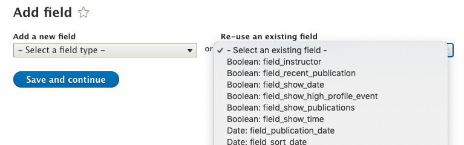

# Fields

This page contains generic info regarding fields as an overall concept, not implementation ideas or guides for specific types of fields. For specific info on implementing a particular type of field, check out the "Fields" section of this guide in the sidebar.

## Strategy for creating fields

When you create a field in Drupal, that field can be reused for future content types. A small amount of configuration per field is **permanent** and cannot be changed after the field **contains data**. Since fields can be reused on other content types, it is advantageous to give fields generic, simple names that describe their use. The machine name should be short and simple. The Label will generally inform what the machine name is, but unlike the machine name, the Label can be adjusted per content type.

As an example, you might have the need to create a Faculty content type. Each Faculty has a headshot they need displayed on the page. Instead of creating a new Headshot field, we could reuse a Thumbnail field from another content type, and just change the Label to "Headshot".

This way, we can reuse all the code we used to preprocess the Thumbnail field to do the same for the Headshot. 

Another reason to do this is to reduce the total number of fields in the CMS. While there's no real performance hit of having dozens of unique fields, creating new content types becomes cumbersome when there are dozens and dozens of fields to choose from. Drupal will present to you every field it can find that isn't part of the content type you are editing when trying to add a new field to it, and if you need to reuse an existing field, finding it can be time consuming. This is just general guidance to keep the site as clean as possible to improve maintenance effort.

### Body

Every content type will start with the Body field. You can delete the field if you do not need it.

!> Make sure you have at least one field that uses the Body field created before deleting it. If no content types are using the Body field, it vanishes from the CMS and is difficult/near impossible to recover.

### Text

There are a few different types of text fields. For our use, they can be classified as short and long fields.

1. Plain text
2. Plain text (long)
3. Formatted text
4. Formatted text (long)
5. Formatted text (long, with summary)

A _formatted_ field is one that is processed by a Drupal Text Format to do things like parse HTML, create and replace links or text, render images or embedded nodes, fix invalid inline markup, etc. 

The "Plain text" and "Formatted text" fields are both one-line text input fields. Long fields are typically textareas, but the key difference between plain and formatted long fields is that formatted long fields will be enhanced with CKEditor.

Use a short field if you only need a small amount of text (255 characters or less) and are not expecting markup. If you wish to allow markup, you can use a formatted short field. 

!> Formatted short fields may have unexpected behavior, since all Text Format rules are run on it. Make sure you know what will happen to the data before using a formatted field.

Use a long field if you need WYSIWYG content, or are expecting longer types of content, such as captions, teasers, short paragraphs, etc. Plain text long fields are better if you want a few sentences of copy but are not expecting or do not want markup.

The formatted text field _with summary_ allows an editor to provide an alternative, shorter amount of text for any given WYSIWYG field, that can be used in an alternative display mode of the node. The **Body** field is a formatted long text field with summary.

### Image vs Media

Images can be embedded in a node in two different ways: An image field or a Media field.

A standard image field allows the user to upload a file from their computer directly into the node, using a native File input field.

It does **not** allow a user to choose an existing file that has already been uploaded. Uploading the same file again will **not** overwrite the earlier file, but instead create a duplicate.

You can enhance this field with modules to improve this behavior. One such module is [IMCE](https://www.drupal.org/project/imce).

The downside of using image fields, even enhanced with IMCE, is that eventually your site may have dozens, hundreds, even thousands of assets, and navigating this via an asset manager like IMCE can prove difficult or cumbersome. There are ways to enforce a level of organization in IMCE, but it requires diligence of the client and development to ensure this happens. 

Media fields are a new type of field added during Drupal ~8.6. They treat images, videos, audio files, documents, etc. as Drupal entities, rather than file system assets. These entities are managed within the standard content views of the CMS, and allow much better usability in terms of finding existing media and managing it.

Before creating a Media field, you must set up Media types under `/admin/structure/media` so that the fields can create and query those types of Media entities. There are 5 types of supported Media sources Drupal will let you hook up. 

1. File
2. Audio file
3. Video file
4. Remote video
5. Image

You could create multiple Media types that use the same sources, for example if you needed to track Thumbnails separate from Mastheads.

