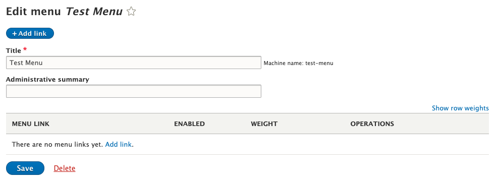
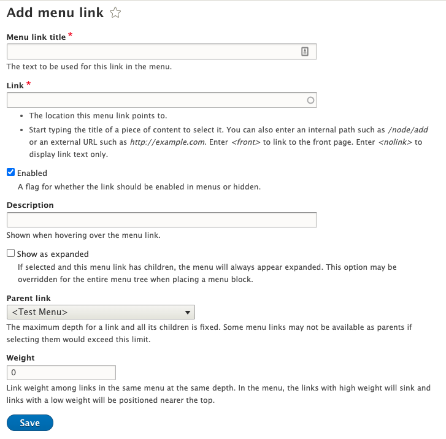
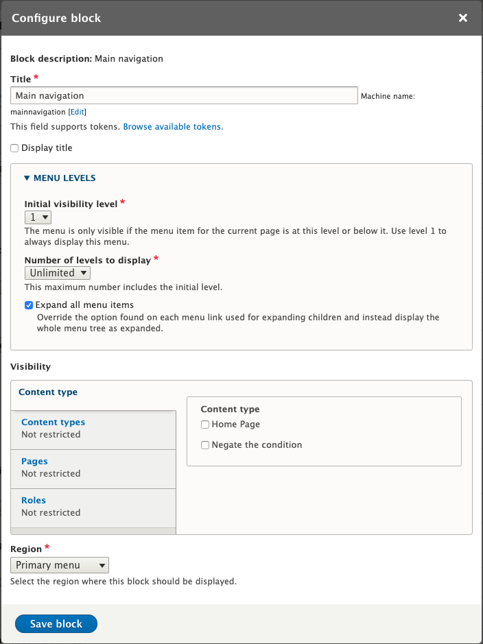

# Menus

Navigation on a Drupal site is done through a module called Menus. This is part of Drupal 8 core. 

Menus offer a flexible way to manage a facsimile of a site tree, while also allowing external links to be placed in the tree along with references to internal nodes or features of the site. There is not always a 1-to-1 correlation of a link to a node in the CMS, and a menu link. It is also possible for a node to be linked in several menus, or more than once in a single menu.

You will need several menus on a standard site. Possible menus include:

1. Main navigation in header (typically with dropdowns revealing more navigation)
2. Audience or secondary navigation in header (if both are required, you will need two menus)
3. Any navigation in the footer.
4. Any major, persistent CTA links in the footer. (e.g. Apply Now, Visit, etc.)
5. Sidebar navigation. See section further down for recommendations on sidebar menus.

## Performance issues

An important factor to note with a menu is preventing one single menu from getting too large. The entire site tree of a typical large site should not exist in one single menu. PHP has maximum variable limits that can be hit very quickly when editing a large menu.

A recommendation that has been used in other Higher Ed implementations is to use a menu for each high level in the site tree. There is code in the default theme that will only render the appropriate menu for a page, based on what menu that page exists in. 

!> This code is located at `/docroot/themes/brei/php/preprocess/menu.php`

The default theme comes with a region called "Sidebar Menu". You will need to place each sidebar menu you create into this theme on the Block layout screen, located at `/admin/structure/block`.

For every "High Level" menu you create, place those menus in the Sidebar Menu region, and the code of the theme should render only the appropriate menu based on the page you are on and what menu that page exists in.

## Creating a menu

Navigate to `/admin/structure/menu`

To create a new menu, click the "Add menu" button.

Type in a title for the menu. You should notice after you finish typing that Drupal automatically generates a machine name for the menu. The machine name is important because it is used in templates and preprocessing to produce code specific to this menu. You can use Drupal's generated name, or you can edit the machine name to produce something more appropriate. The sample theme uses "navigation-" as a common naming convention but it is not required.

Don't worry about the Administrative summary at this point. This field allows you to provide context to someone viewing the menu config and see the purpose for each menu, but does not affect functionality in any way. You can always edit this later.

The next screen is where you can adjust the Title and Administrative summary, but not the machine name. You can also add links from this screen.

Click "Add link" to add a link to the menu.

On this screen, the Link field can accept both an autocompleted node title from within the site, as well as a custom URL. Start typing in the field to see options from within the site.

The Menu link title is the text that displays for the link in the menu, and does not have to match the title from the page or custom URL. It can be managed by editing menu items or from the node itself.

The enabled checkbox will toggle whether this link appears in the menu when rendered. It doesn't affect the page itself (e.g. it won't unpublish the targeted node).

The description field offers a way to provide title text to the menu link.

The "Show as expanded" option is very important. If you are rendering this menu and want the child items to be accessible by the renderer, you must check this box for the parent links. So as an example, if you had the following menu:

    - Parent
    -- Child
    -- Child
    - Parent
    -- Child

Both parent links in the menu would need "Show as expanded" to be checked, otherwise the child links would not come back from Drupal when doing any PHP preprocessing.

In the parent link dropdown, you can choose the parent of this menu link.

The weight is a numeric ordering that determines the order of the links inside the menu. Don't worry too much about filling this out, as you can rearrange the links by dragging and dropping them on the Menu edit screen.

## Placing a menu

Navigate to the Block layout screen located at `/admin/structure/block`

Find the region in the list you wish to place the menu, and click "Place block".

Find your menu in the list. You can place blocks multiple times in a region so make sure you are only placing each menu once. The block for your menu is the same name as the menu itself. 

After clicking "Place block" again next to your menu, the screen that follows allows you to configure this specific instance of the block.

!> For sidebar navigations, recommended settings match the following screenshot

Don't worry about the visibility settings unless you need to control that for this menu.
