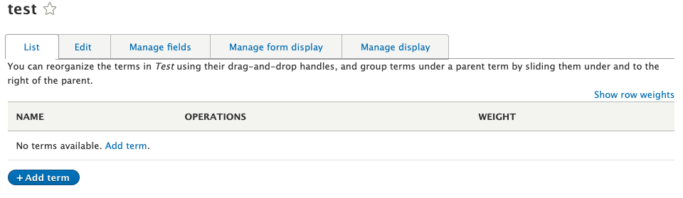
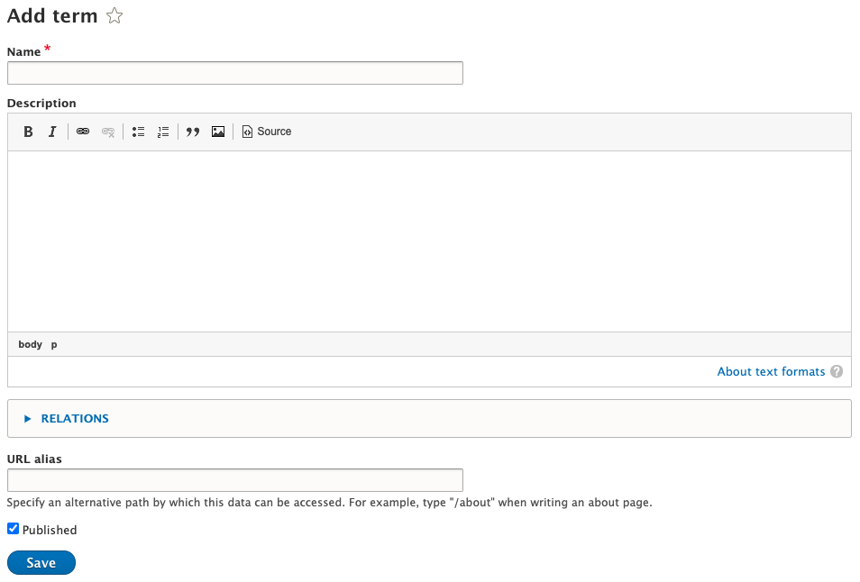

# Taxonomy

Taxonomy is used to classify website content in Drupal. Individual taxonomy items are known as *terms* and a set of terms is known as a *vocabulary*.

## Taxonomy strategy

Typically, the Vocabularies you create will correlate with the ways you can filter portions of content on an Aggregate or any kind of curation component. This is something you will need to coordinate with UX to determine what unique Vocabularies are required for each content type.

It's recommended that you try to reuse Vocabularies across multiple content types, if possible. For example, if a Faculty node and a Course node can both be associated with an Area of Study, you should only create one "Area of Study" Vocabulary to use for both.

Terms can be organized into trees within a single Vocabulary, but this is generally **not recommended** unless the Vocabulary is complex enough to require it. Additional modules may be necessary to support deep tree taxonomy fields.

Each vocabulary will typically have one field associated with it on content types. It's possible to choose more than one vocabulary when creating a taxonomy field, but this may overcomplicate the field and produce unexpected or undesired behavior. Only do this if you understand the implications.

## Creating a Vocabulary

Navigate to `/admin/structure/taxonomy`

To create a new vocabulary, click the "Add vocabulary" button.

Type in a title for the vocabulary. You should notice after you finish typing that Drupal automatically generates a machine name for the vocabulary. The machine name is important because it is used by the custom theme in certain functions to pull terms from the vocabulary and format them in different ways.

Don't worry about the Administrative summary at this point. This field allows you to provide context to someone viewing the vocabulary config and see the purpose for each vocabulary, but does not affect functionality in any way. You can always edit this later.

The next screen is where you can add and reorganize terms in the Vocabulary. To edit the name or administrative summary, click the "Edit" tab at the top.

Do not worry about the fields, form display, or display tabs. While it is possible to add fields to a vocabulary's terms, this guide has no info on the benefits or reasoning to do this.

Click the "Add term" link to add a term.

On this screen, you only need to worry about the Name field. That is all that will be displayed to the content editor.

Relations is for creating a tree of terms. It can be safely ignored unless you need to create a tree.

Make sure the "Published" box is checked and click "Save". You have created a taxonomy term.

As you add more terms, you can rearrange them on the "List" tab for a Vocabulary. By default, it organizes them alphabetically, but they can be reorganized by dragging the terms up and down the list. You can also easily create trees of terms by moving a term underneath another term, so be careful when reorganizing terms.

Reorganizing terms will not affect any nodes that have already been tagged.
