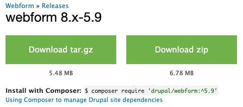

# Installing a new module

Installing a module with the boilerplate setup uses Composer to manage the dependency.

## Project page

First, you will need to locate the Drupal.org project page for your desired module. In this example, we'll work with the Webform module, a very powerful and popular form builder for Drupal 8.

Drupal.org's site search is not ideal, so you may need to use Google to find the project page. Searching "Drupal 8 MODULENAME" typically gets the desired result.

Webform's project page is [https://www.drupal.org/project/webform](https://www.drupal.org/project/webform)

## Finding the composer release

Modules may have more than one recommended release, if you are interested in development release or release candidates of a module. Typically, the release on the project page will be located towards the bottom, under a section called "Downloads", and will have messaging whether or not it is recommended by the maintainer.

!> A release may also have a shield icon next to the name. This means the release has been reviewed by the Drupal Security Team and meets their guidelines.

Do not download the files for the release, instead click on the version name.

You'll be taken to a page describing the release. On this page will be a composer require statement, showing you how to install the module via composer.

You can copy and paste this statement into the terminal to install the module. You must be in the same directory as the composer.json file.

!> Most of the time, the composer require statement uses the same slug as the URL on drupal.org. If the project is `drupal.org/project/foo`, the composer statement will likely be `composer require drupal/foo`.
