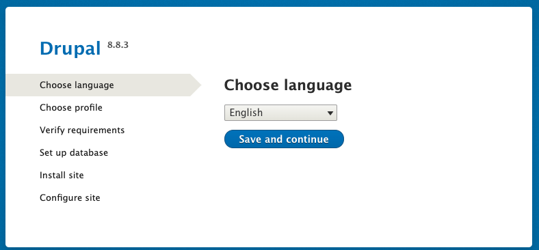
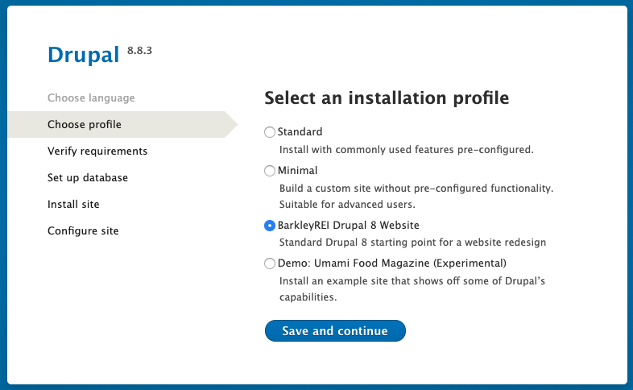
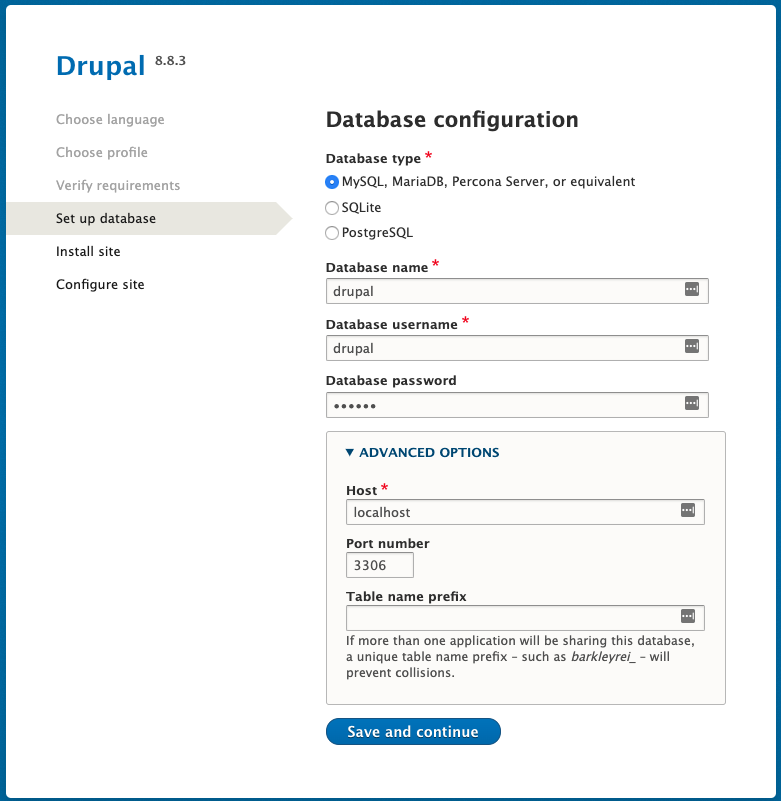
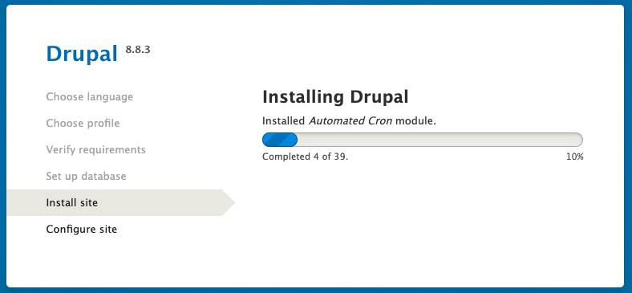
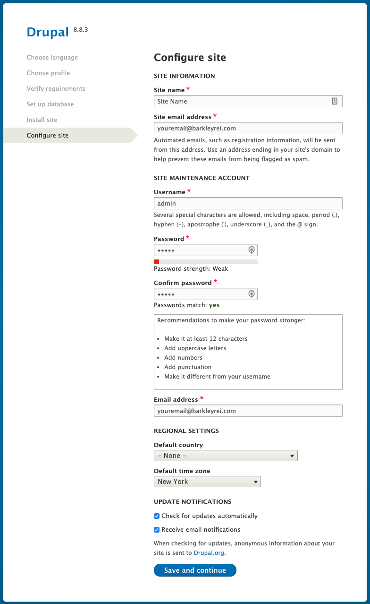
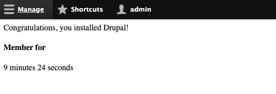

# Project Initialization

## Prerequisites

### Composer

You will need composer to install modules and core. You can find info on installing composer at [getcomposer.org](getcomposer.org).

### Local Server

You will need some kind of localhost server. You can set this up manually using Apache, install something like Xampp or MAMP, or anything else you are comfortable with. This guide will assume you are working on a local environment, so if you plan to use a remote environment you will need to compensate for that environment in any instructions.

Make sure your local server has access to PHP 7 (as recent as possible), as well as MySQL. 

## Boilerplate

BarkleyREI maintains an opinionated boilerplate Drupal 8 project codebase for sites powered by Drupal 8.

You can find the project on Stash here:

[Drupal 8 Boilerplate](https://stash.barkleylabs.com/projects/BREID/repos/drupal-8-boilerplate/browse)

!> If you don't have access to the above repository, request it from a coworker or manager.

You can either clone the repo to your computer or download it as a zip file.

## Project Structure

If you create a repository for the client website, the root of the repository will be the contents of the boilerplate. This means in your root directory, you should have the following folders and files:

```text
docroot/
drush/
.gitignore
BREI_README.md
composer.json
composer.lock
```

When you set up a local server, you will serve the `docroot` directory as the root of the server.

!> This should be done before initializing the static generator for your project. See more information under Static Coding.

## Installing dependencies

Open a terminal window and navigate into the root directory where you dropped the boilerplate. You should be in the same directory as `composer.json`.

Run the following command:

`composer install`

This will install contributed modules, Drupal core, and any vendor dependencies. 

!> These directories should be ignored by Git already, but if they are not, make sure you do not commit Drupal Core, contributed modules, or any code in the vendor directory, as these directories can change frequently and unexpectedly.

## Installing Drupal

When you load up your server, you should see Drupal's install screen.



Click to continue, where you will select a profile. In this boilerplate, we have provided a profile to quickly set up a Drupal 8 site with many recommended modules. If you do not see this profile listed, please choose the "Minimal" profile.



Drupal will scan your setup to ensure there are no issues. If there are, you will see the following screen. Resolve any issues (if required), or continue if the issues do not impede the site.

!> In the example below, the server is missing Opcode caching, which Drupal 8 recommends, but it is not required and can be skipped.


Enter your database connection information. For a local database, it's recommended that you create a user that has full access to it's own named table, to reduce complexity. 



Sip a coffee and watch the site install.



Enter some basic information about your site. You'll be able to edit all this information later, so it's not a big deal to enter placeholder data at this point. Make sure the email addresses are real and set up to your email address, as you'll get notified of updates and other information about the site.

!> Project tip: For a client's website, you will want to eventually change the site email to an internal email on their side, or else you will get update emails daily or weekly forever, and you may also get unwanted form submission data from the Webform module.

!> For now, using **admin/admin** as a super user account is fine, but plan to change this password if you deploy this database to a remote environment.



If you see the next screen, you have installed Drupal! 



Godspeed.

## Local Development Environment Configuration

There are two files in the `/settings` directory that can improve local development of a Drupal 8 site.

### development.services.yml

Located at `/docroot/sites/development.services.yml`, the development services file enables settings that can improve development. Here are recommended settings for this file:

```yaml
# Local development services.
#
# To activate this feature, follow the instructions at the top of the
# 'example.settings.local.php' file, which sits next to this file.
parameters:
  http.response.debug_cacheability_headers: true
  twig.config:
    cache: false
    auto_reload: true
    debug: true
services:
  cache.backend.null:
    class: Drupal\Core\Cache\NullBackendFactory
```

The primary purpose of all the above statements is to reduce how heavily Drupal caches pages and templates so that you don't need to clear cache any time you make a code change. There are likely other possible settings for this file that are not detailed in this guide.

This file is added by composer's install, and is safe to version in Git, since it is not included in the project unless the next file is created.

### settings.local.php

Located at `/docroot/sites/example.settings.local.php` is a local settings file you will need to copy into the `default` directory, and remove "example" from the filename.

This file includes the above mentioned development services file, and also enables some other functionality in Drupal that turns off more caching and enables verbose debugging output, which is essential in figuring out where any PHP errors are in your codebase.

This file is also added by composer's install, but it is ignored by gitignore.
