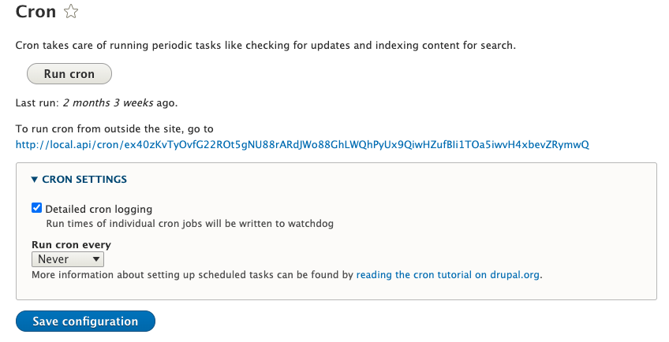
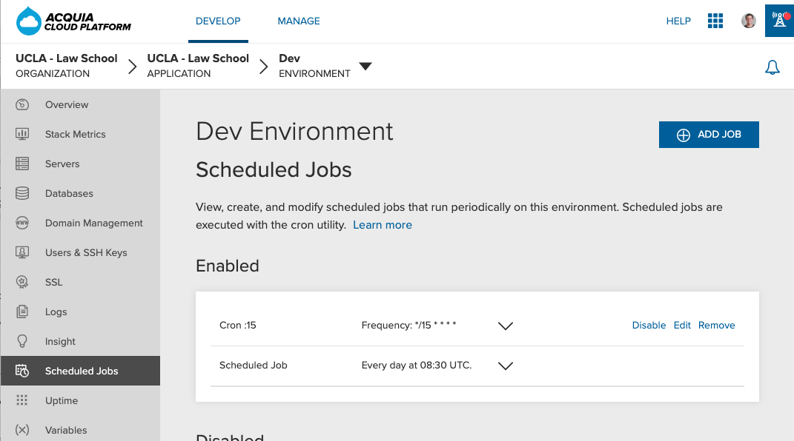

# Acquia

## Creating a Scheduled Job in Acquia

Scheduled jobs are important for a Drupal site, because we want the site cron to be run on a regular schedule. Running cron during a server request is not a reliable method of running cron. Your tasks might not run at all during off hours, when the site has less traffic, and might cause intense slow downs for anyone visiting the site.

Before creating a scheduled job, navigate to `/admin/config/system/cron` and change the dropdown to "Never". This ensures that cron will not run on a server request, and can only be run manually.



Scheduled Jobs are configured for each environment. We'll use the Dev environment as an example. Navigate to this environment in the Acquia Cloud interface, and choose the "Scheduled Jobs" option in the left sidebar.



Acquia recommends using Drush to run cron. The following is a command provided by Acquia Support to run the drush cron command and log the output to a file. The URL is for UCLA Law's Development environment.

```
/usr/local/bin/drush9 --uri=https://uclalawdev.prod.acquia-sites.com/ --root=/var/www/html/${AH_SITE_NAME}/docroot -dv cron &>> /var/log/sites/${AH_SITE_NAME}/logs/$(hostname -s)/drush-cron.log
```

You will change the URL to the environment you are running the command on, but everything else will remain the same across environments.

Click "Add Job" and a modal window will appear. You will paste the command into the command text area. Give the job a name that will make sense to others.

The command frequency is a crontab interval format. You can generate one at the following url: [https://www.crontab-generator.org/](https://www.crontab-generator.org/)

As an example, to run cron every 15 minutes, you would use the following frequency: 

`*/15 * * * *`
